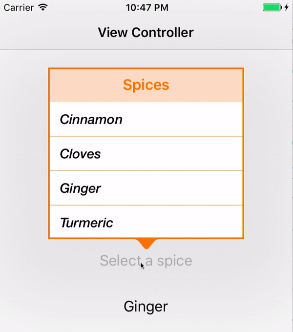

<p align="center">
  
  </br></br>
  
  
  
  
</p>

## Overview

LCUIComponents is an on-going project, which supports creating transient views appearing above other content onscreen when a control is selected. Currently, the framework provides supports to simply create a customisable popover with a selectable data list.

<p align="center"></p>

## Requirements

* iOS 8.0+
* Xcode 8+
* Swift 3

## Usage

The following is an example of how to create a popover. For more advanced use please check out the `Sample` path.

### Set up a basic popover with data list

```swift
import LCUIComponents
import UIKit

class PopoverSamplesVC: UIViewController {
    
    // Create a data source
    let spiceList: [LCTuple<Int>] = [(key: 1, value:"Cinnamon"),
                                     (key: 2, value:"Cloves"),
                                     (key: 3, value:"Ginger"),
                                     (key: 4, value:"Turmeric"),
                                     (key: 5, value:"Tamarind")]
    
    @IBAction func btnPopoverTapped(_ sender: UIButton) {
        setupBasicPopover(for: sender)
    }
    
    func setupBasicPopover(for sender: UIView) {
        // Init a popover with a callback closure after selecting data
        let popover = LCPopover<Int>(for: sender, title: "Spices") { tuple in
            // Use of the selected tuple
            guard let value = tuple?.value else { return }
            print(value)
        }
        // Assign data to the dataList
        popover.dataList = spiceList
        // Present the popover
        present(popover, animated: true, completion: nil)
    }
}
```
### Set up a custom popover with data list

```swift
func setupCustomPopover(for sender: UIView) {
    // Init a popover with a callback closure after selecting data
    let popover = LCPopover<Int>(for: sender, title: "Spices") { tuple in
        // Use of the selected tuple
        guard let value = tuple?.value else { return }
        print(value)
    }
    // Assign data to the dataList
    popover.dataList = spiceList

    // Set popover properties
    popover.size = CGSize(width: 250, height: 219)
    popover.arrowDirection = .down
    popover.backgroundColor = .orange
    popover.borderColor = .orange
    popover.borderWidth = 2
    popover.barHeight = 44
    popover.titleFont = UIFont.boldSystemFont(ofSize: 19)
    popover.titleColor = .orange
    popover.textFont = UIFont(name: "HelveticaNeue-MediumItalic", size: 17) ?? UIFont.systemFont(ofSize: 17)
    popover.textColor = .black

    // Present the popover
    present(popover, animated: true, completion: nil)
}
```

## Installation

### CocoaPods

Specify LCUIComponents into your project's `Podfile`:

```ruby
source 'https://github.com/CocoaPods/Specs.git'
platform :ios, '9.0'
use_frameworks!

pod 'LCUIComponents'
```

### Manually as Embedded Framework

Simply download and add the `Popover.swift` file from `Source` path to your project.


